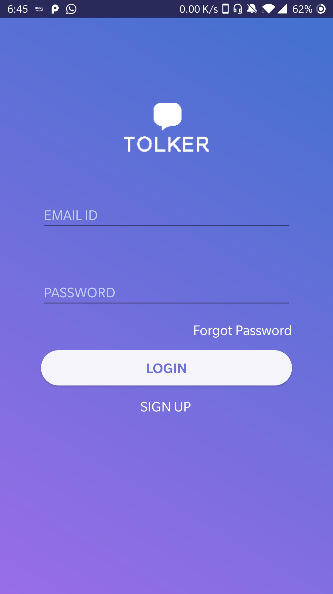
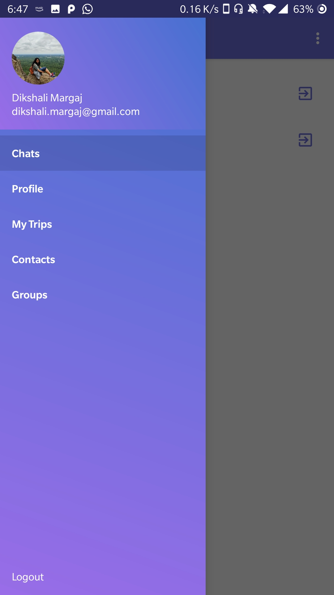
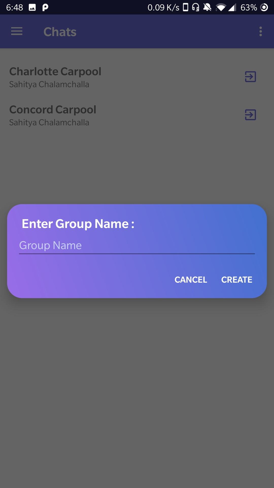
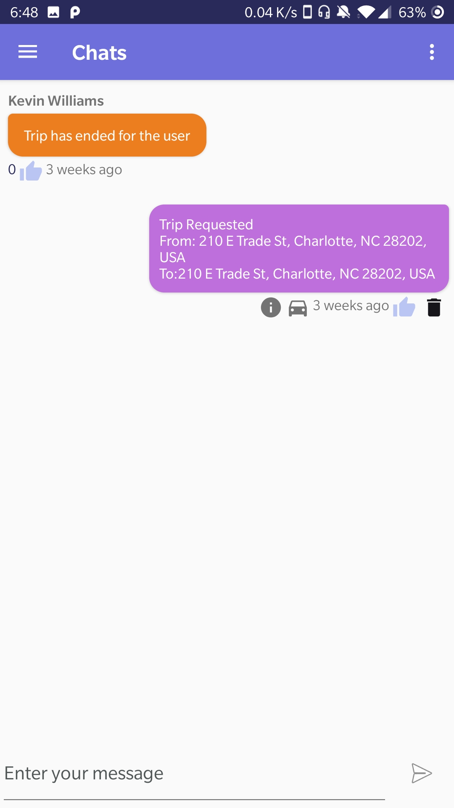
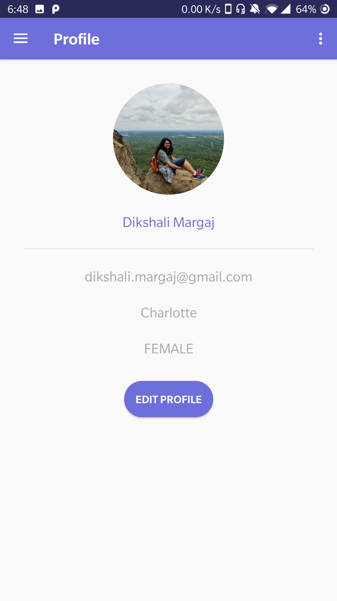
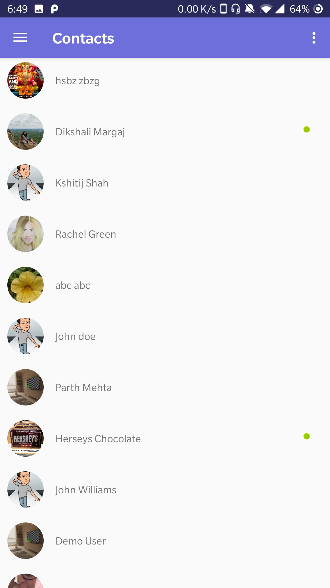
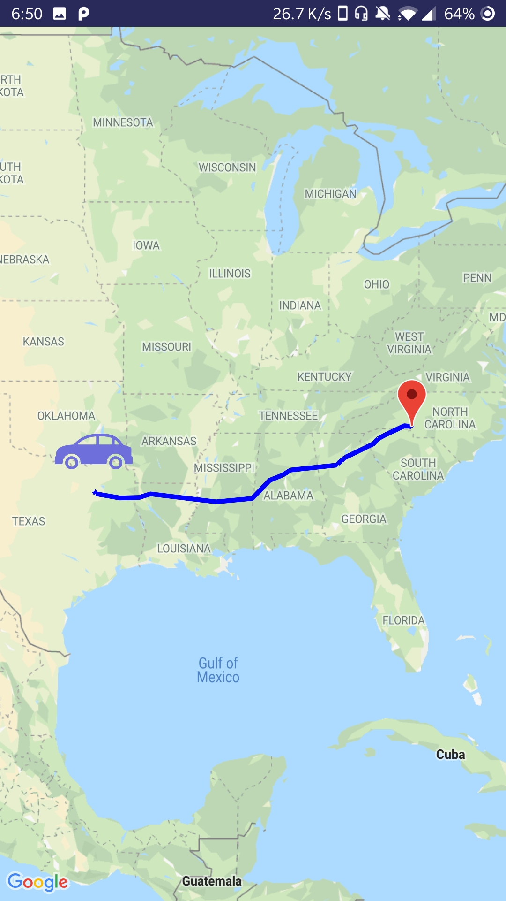

# The-Chat-Rooms

Its a chat application where logged in user can create a group or join any available groups. User can also request for a ride in a group.

## **Technologies:**
* Mobile Framework: Android
* Storage/Database: FireBase
* API: Google service such as Google Direction, Google Maps, Geocoding API

Wireframe link: [The Chat Room Wireframe](https://xd.adobe.com/spec/6d6bdcb8-7eec-412a-4a8b-bb3f19662cce-1b5a/)

Application Demonstration Video: [The Chat Room Demo](https://youtu.be/C1hdzuxiKxg)

## Screenshots

Login Screen             |Navigation Screen             |Group Chat Rooms list Screen            |Create Group Dialog             |
:-------------------------:|:-------------------------:|:-------------------------:|:-------------------------:
  |   |   |  

Chat Screen where user request a ride             |Profile Screen             |List of user with online status            |Map show Driver's location to pickup rider            |
:-------------------------:|:-------------------------:|:-------------------------:|:-------------------------:
  |   |   |  

## Getting Started

These instructions will get you a copy of the project up and running on your local machine for development and testing purposes.

### Prerequisites
* Android Studio [Download Android Studio](https://developer.android.com/studio)
* Firebase
* API key for Google Map SDK for android. [Tutorials](https://developers.google.com/maps/documentation/android-sdk/intro) 

### Installing

1. Clone the repository.
2. Open the project in Android Studio.
3. Install Android Emulator. [Follow steps](https://developer.android.com/studio/run/emulator#install)
4. Run the project on android emulator.
